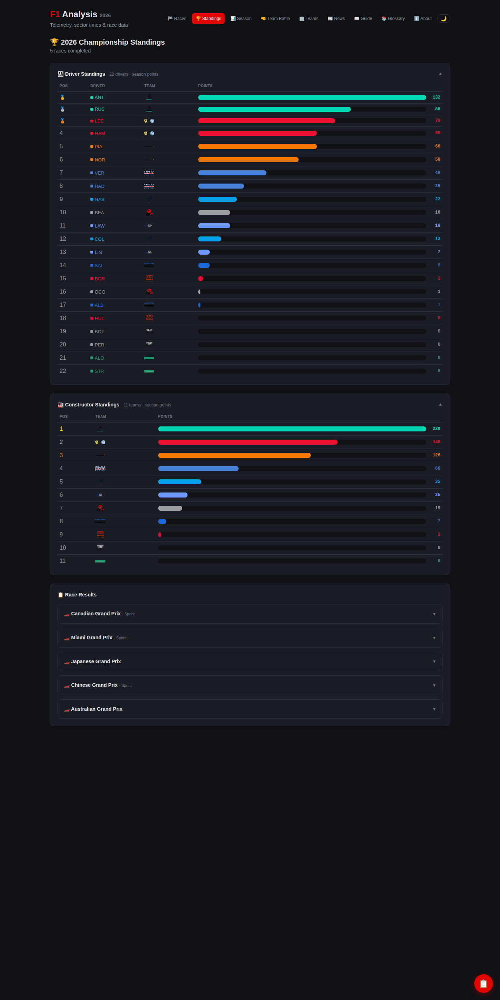

# F1 Analysis 2026 🏎️📊

[](LICENSE)
[](https://www.python.org/)
[](https://fastapi.tiangolo.com/)
[](https://www.postgresql.org/)
[](https://github.com/edsuwarna/f1-analysis/commits/main)
[](https://github.com/edsuwarna/f1-analysis)

> **Real-time Formula 1 telemetry & performance analysis platform.**  
> Driver comparisons, race strategy insights, and season analytics — powered by [OpenF1 API](https://openf1.org/).



**🌐 Live:** [f1-analysis.edsuwarna.id](https://f1-analysis.edsuwarna.id)  
**📚 Docs:** [f1-analysis-docs.pages.dev](https://f1-analysis-docs.pages.dev)

---

## 🏗️ Architecture

```
┌────────────────────────────────────────────┐
│          Cloudflare Pages (CDN)            │
│     f1-analysis.edsuwarna.id               │
│       Vanilla JS + Chart.js 4              │
└──────────────────────┬─────────────────────┘
                       │
┌──────────────────────┴─────────────────────┐
│          VPS (Docker Compose)               │
│  ┌──────────┐  ┌──────────┐  ┌──────────┐ │
│  │ FastAPI  │  │PostgreSQL│  │Ingestion │ │
│  │  :8000   │  │  :5432   │  │(on-demand)│ │
│  └────┬─────┘  └──────────┘  └──────────┘ │
│       │                                     │
│  ┌────┴─────┐                               │
│  │ OpenF1   │ (external API)                 │
│  │ API      │                               │
│  └──────────┘                               │
└──────────────────────────────────────────────┘
```

**Stack:** Python 3.12 · FastAPI · SQLAlchemy (async) · PostgreSQL 18 · Vanilla JS · Chart.js 4 · Docker Compose · Cloudflare Pages

---

## ✨ Features

### 🏁 Session Analysis (per GP)
- **Best Sector Times** — fastest S1/S2/S3 with 🟣/🟢/🟡 color ranking
- **Qualifying Evolution** — Q1→Q2→Q3 progression chart
- **Lap Distribution** — pace vs consistency scatter plot
- **Position History** — lap-by-lap race positions
- **Pit Strategy Battle** — undercut analysis, stint comparison
- **Tyre Strategy Timeline** — visual compound timeline
- **Pit Stop Analysis** — stop times ranking & pit windows
- **Weather Impact** — air/track temperature, humidity, pressure
- **Driver Comparison** — side-by-side stats + telemetry overlay
- **Gap Timeline** — cumulative gap to leader
- **Overtake Analysis** — position changes per lap
- **Track Position Map** — circuit visualization with lap slider
- **Tyre Degradation** — lap time vs tyre age scatter

### 📊 Season & Championship
- **Driver Standings** — points with progress bars & medals
- **Constructor Standings** — team championship
- **Race Results** — per-GP with Race/Sprint separation
- **Points Progression** — cumulative line chart across rounds
- **Head-to-Head** — driver vs driver qualifying & race matchups
- **Pit Stop Championship** — team pit speed rankings

### 📦 Data Export
CSV download for laps, telemetry, stints, pit stops, and weather — per session.

---

## 🚀 Quick Start

### Prerequisites
- Docker & Docker Compose v2

### Setup

```bash
git clone https://github.com/edsuwarna/f1-analysis.git
cd f1-analysis
cp .env.example .env    # edit PostgreSQL password
docker compose up -d postgres backend
```

### Ingest Data

```bash
# List available GPs
docker compose run --rm ingestion python -m backend.ingestion.ingest_openf1 --year 2026 --list

# Ingest a specific GP
docker compose run --rm ingestion python -m backend.ingestion.ingest_openf1 --year 2026 --gp Australia

# Ingest full season
docker compose run --rm ingestion python -m backend.ingestion.ingest_openf1 --year 2026 --all
```

Open [http://localhost:8000](http://localhost:8000) after ingestion.

---

## ⚙️ Configuration

| Variable | Default | Description |
|---|---|---|
| `POSTGRES_PASSWORD` | — | Database password (required) |
| `POSTGRES_DB` | `f1_analysis` | Database name |
| `POSTGRES_USER` | `f1_user` | Database user |
| `DATABASE_URL_SYNC` | auto | Sync connection string |
| `DATABASE_URL_ASYNC` | auto | Async connection string |
| `CACHE_DIR` | `/app/cache` | Fast-F1 cache directory |
| `CORS_ORIGINS` | `*` | Allowed CORS origins |

---

## 📡 API

Full interactive docs at `/docs` (Swagger UI) when the backend is running.

**Key endpoints:**

- `GET /api/meetings` — List race weekends
- `GET /api/meetings/{id}/sessions` — Sessions in a meeting
- `GET /api/sessions/{id}/laps` — Lap data with sectors & compounds
- `GET /api/sessions/{id}/telemetry/{driver}` — Speed, throttle, brake, DRS, RPM
- `GET /api/analytics/championship?year=2026` — Driver & Constructor standings
- `GET /api/analytics/season-progression?year=2026` — Cumulative points chart data

---

## 🎨 Frontend

- **Dark/Light theme** — persisted to localStorage
- **Responsive** — mobile-first design
- **Floating ToC** — "Jump to Section" navigation
- **Driver picker** — checkbox filtering on charts
- **CSV export** — one-click download per session
- **Team logos** — SVG team branding throughout

---

## 🤝 Contributing

1. Fork the repo
2. Create a feature branch (`git checkout -b feat/my-feature`)
3. Commit changes (`git commit -am 'add my feature'`)
4. Push to branch (`git push origin feat/my-feature`)
5. Open a Pull Request

---

## 📄 License

MIT — © [Endang Suwarna](https://edsuwarna.id)
